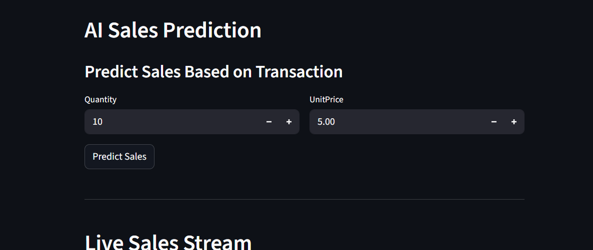
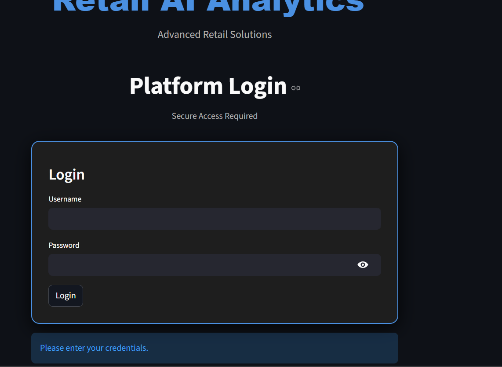
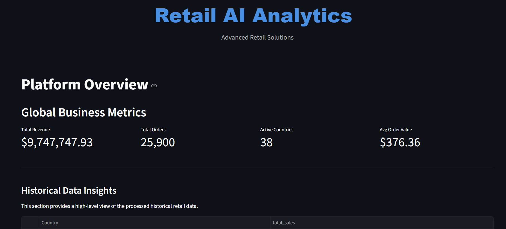
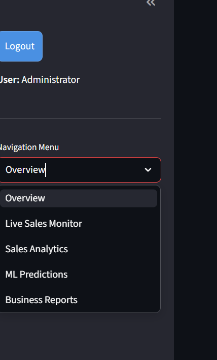

# 🛒 Retail AI Analytics Platform

[](https://www.python.org/)
[](https://spark.apache.org/)
[](https://streamlit.io/)

A full-stack data analytics platform that processes large-scale retail sales data using Apache Spark and visualizes insights through an interactive Streamlit dashboard. The system also includes machine learning-based sales prediction, real-time streaming simulation, and automated business report generation.

## 🚀 Project Overview
The **Retail AI Analytics Platform** is designed to provide businesses with actionable insights from their sales data. By combining big data processing capabilities with modern web visualization, it enables stakeholders to track performance, predict future demand, and monitor live sales streams in a single, secure interface.

## ✨ Key Features
- **🐘 Big Data Processing**: High-speed data transformation using Apache Spark.
- **📊 Interactive Dashboard**: A multi-page Streamlit application for data discovery.
- **🤖 ML Sales Prediction**: Demand forecasting powered by Scikit-learn.
- **📡 Real-Time Sales Streaming**: Live sales simulation and monitoring.
- **🌍 Global Sales Visualization**: Interactive choropleth maps of global revenue.
- **📈 Business KPI Metrics**: Automated tracking of Revenue, Orders, and AOV.
- **🔐 Authentication System**: Secure login with encrypted password protection.
- **📄 Automated Report Generation**: One-click PDF and Excel report exporting.

## 🛠️ Technology Stack
- **Languages**: Python
- **Big Data**: Apache Spark
- **Web Framework**: Streamlit
- **Machine Learning**: Scikit-learn
- **Data Analysis**: Pandas, NumPy
- **Visualization**: Plotly, Matplotlib
- **Reporting**: ReportLab, XlsxWriter

## 🖥️ Dashboard Pages
- **Overview**: High-level business metrics engine showing Total Revenue, Total Orders, Active Countries, and Avg Order Value.
- **Sales Analytics**: Deep-dive charts and global maps with interactive filters.
- **ML Predictions**: Demand forecasting tools powered by machine learning.
- **Live Sales Monitor**: Dedicated page for real-time sales tracking with live-updating tables and charts.
- **Business Reports**: Centralized hub to generate and download professional PDF and Excel reports.

## 🏗️ Project Architecture
The platform follows a standard data engineering pipeline:
`Raw Data (CSV)` → `Spark Processing` → `Processed Sales Data` → `ML Model Training` → `Analytics Dashboard`

## 📁 Folder Structure
```text
optimus/
│
├── analysis/         # ML training and report generation scripts
├── data/             # Raw and processed datasets
├── pipeline/         # Airflow DAG definitions
├── assets/           # UI visual documentation
├── spark_jobs/       # Spark transformation and streaming simulator
├── ui/               # Streamlit dashboard and configuration
├── requirements.txt  # Project dependencies
└── README.md         # Project documentation
```

## ⚙️ Installation Guide
1. Clone the repository to your local machine.
2. Install the required dependencies:
```bash
pip install -r requirements.txt
```

## 🏃 Running the Project
### 1. Process Historical Data
Run the Spark job to clean and aggregate the raw retail data:
```bash
py -3.11 spark_jobs/process_sales.py
```

### 2. Run the Dashboard
Launch the interactive Streamlit analytics platform:
```bash
py -3.11 -m streamlit run ui/dashboard.py
```

### 3. Run Live Sales Stream
Start the real-time sales simulator to feed the Live Monitor:
```bash
py -3.11 spark_jobs/stream_sales.py
```

## 📸 Dashboard Preview



## Sales Analytics



## ML Predictions



## Live Sales Monitor



## 🔮 Future Improvements
- **Kafka Integration**: Transition to production-grade real-time stream processing.
- **Advanced Forecasting**: Implementation of LSTM or Transformer models for time-series forecasting.
- **Cloud Deployment**: Containerization with Docker and deployment to AWS/Azure.

---
**Built with ❤️ for Retail Intelligence**
